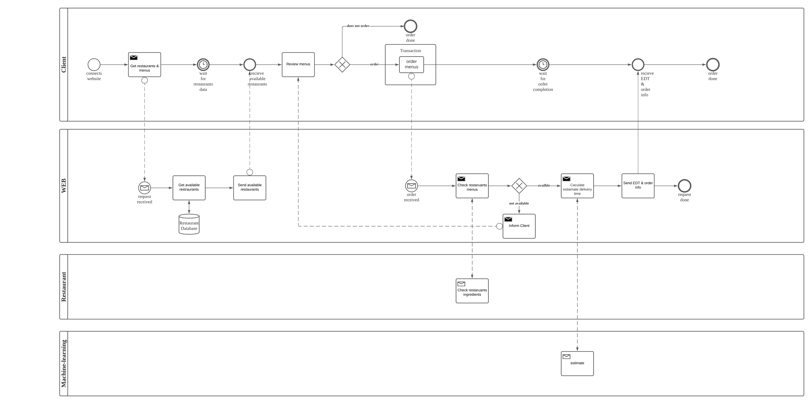

# fast-food-application (In Progress)

## expected BPMN

- [transaction(todo)](https://github.com/sammiee5311/fast-food-application/tree/main)
- [restaraunt(todo)](https://github.com/sammiee5311/fast-food-application/tree/main)
- [machine-learning](https://github.com/sammiee5311/fast-food-application/tree/main/machine-learning-api)

## system design

## Tech Stacks

See

### Back-end
 - flask
 - django
 - fast-api
 - node.js

### Front-end
 - react

### Database
 - postgres
 - sqlite
 - mongodb
 - redis 

### Message
 - kafka 

### Log
 - elasticsearch
 - logstash
 - kibana 

### Machine Learning
 - mlflow 

### Languages
 - python
 - javascript
 - typescript   

### Build 
 - docker

### Proxy
 - nginx
 
### CI / CD
 - gitHub actions  
 - heroku 
 

 

## servers

- [django](https://github.com/sammiee5311/fast-food-application/tree/main/django)
- [react](https://github.com/sammiee5311/fast-food-application/tree/main/react)
- [kafka](https://github.com/sammiee5311/fast-food-application/tree/main/kafka)
- [log](https://github.com/sammiee5311/fast-food-application/tree/main/log)
- [order-delivery-time-handler](https://github.com/sammiee5311/fast-food-application/tree/main/order-delivery-time-handler)
- [machine-learning](https://github.com/sammiee5311/fast-food-application/tree/main/machine-learning-api)
- [tracking](https://github.com/sammiee5311/fast-food-application/tree/main/tracking)
- [id-generator](https://github.com/sammiee5311/fast-food-application/tree/main/id-generator)
- [restaurant(todo)](https://github.com/sammiee5311/fast-food-application/tree/main)

## ports

- logstash: `5501`
- elasticsearch: `9200`
- kibana: `5601`
- zookeeper: `2181`
- kafka: `9092`
- kafka-manager: `9000`
- django: `8000`
- order-delivery-time-handler: `8080`
- tracking: `3001`
- react: `3000`
- mlflow: `1234`
- postgres: `5432`

## reference

- [docker-elk](https://github.com/deviantony/docker-elk)
